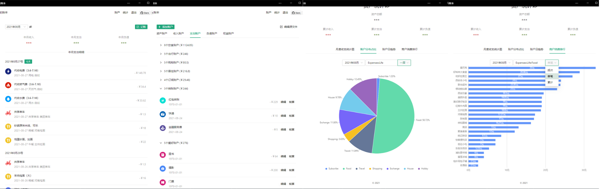

# beancount-gs


[](https://hub.docker.com/repository/docker/xdbin/beancount-gs/general)

[演示地址](https://beancount.xdbin.com/)
[使用文档](https://www.yuque.com/chuyi-ble7p/beancount-gs)

## 介绍

[beancount](https://github.com/beancount/) 是一个优秀的开源复式记账工具，因为其基于文本记录的特性，难以拓展到移动端；本项目旨在将常见的记账行为封装为 RESTful API。

本仓库使用 `Golang` 进行文本的读写和接口服务支持，利用 `bean-query` 获取内容并解析，以 Json 格式返回。并基于已实现的接口内置实现了前端页面（适配移动端）。



## 特性

- [X] 私有部署
- [X] 多账本
- [X] 账户，资产管理
- [X] 统计图表
- [X] 多币种
- [X] 标签
- [X] 投资管理(FIFO)
- [X] 第三方账单导入(支付宝，微信，工商银行，农业银行)
- [X] 分期记账
- [X] 事件

## 如何使用

**本地打包**

1. 克隆本项目到本地
2. 根目录执行 `go build`
3. 执行 `./beancount-gs` (`-p` 指定端口号，`-secret` 指定配置密钥)

**release**

1. 下载并解压项目的 `release` 包
2. 执行根目录下的 `./beancount-gs.exe`

**docker**

```shell
docker run --name beancount-gs -dp 10000:80 \
-w /app \
-v "/data/beancount:/data/beancount" \
-v "/data/beancount/icons:/app/public/icons" \
-v "/data/beancount/config:/app/config" \
-v "/data/beancount/bak:/app/bak" \
xdbin/beancount-gs:latest
```

**docker-compose**

在指定目录创建文件 `docker-compose.yml`，然后复制下面内容到这个文件，执行 `docker-compose up -d`

```yaml
version: "3.9"
services:
  app:
    container_name: beancount-gs
    image: xdbin/beancount-gs:${tag:-latest}
    ports:
      - "10000:80"
    # volumes 挂载目录会导 /app/public/icons 中的图标被覆盖，这里将默认图标在挂载后重新拷贝图标
    command: >
      sh -c "cp -rn /app/public/default_icons/* /app/public/icons && ./beancount-gs -p 80"
    volumes:
      - "${dataPath:-/data/beancount}:/data/beancount"
      - "${dataPath:-/data/beancount}/icons:/app/public/icons"
      - "${dataPath:-/data/beancount}/config:/app/config"
      - "${dataPath:-/data/beancount}/bak:/app/bak"
      - "${dataPath:-/data/beancount}/logs:/app/logs"
```

默认的文件存储路径为 `/data/beancount`，如果你想更换其他路径，可以在当前目录下新建 `var.env`，然后将下面内容复制到这个文件

```properties
tag=latest
dataPath=自定义的目录
```

执行 `docker-compose --env-file ./var.env up -d` 即可

## 项目负责人

[@BaoXuebin](https://github.com/BaoXuebin)

## 开源协议

[MIT](https://github.com/BaoXuebin/beancount-gs/blob/main/License) @BaoXuebin

## 赞助

[赞助地址](https://xdbin.com/sponsor)

## 感谢

<a href="https://jb.gg/OpenSourceSupport" style="display: flex; justify-content: left; align-items: center; flex-direction: row;">

<h3>Licenses for Open Source Development</h3>
</a>
