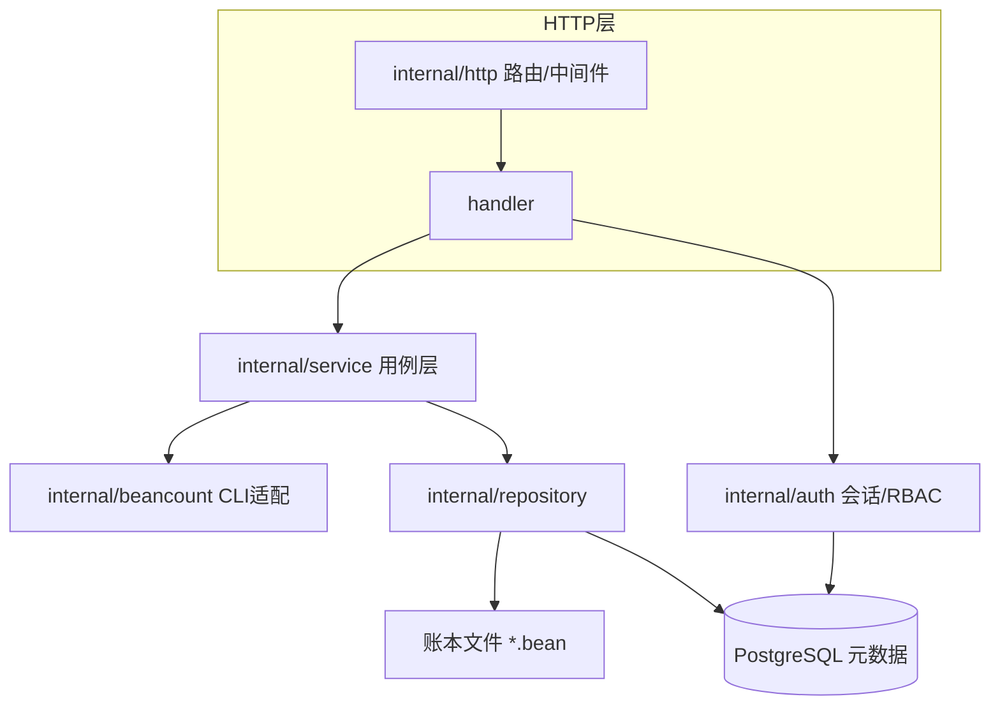

# beancount-gs V2 重构方案

> 状态：v0.3（2026-08-02，关键决策已确认：GitHub OAuth2 / SQLite / 乐观并发 / 单实例 / AI 能力与 MCP 接入）
> 定位：V2 = shadcn/ui 前端 + 前后端同仓 monorepo + SaaS 多用户协作

## 1. V2 目标

1. **前端重写**：放弃 CRA 时代的旧前端，使用 shadcn/ui（React + Vite + TypeScript + Tailwind）重写，保持移动端适配。
2. **单仓库**：前端源码与后端源码统一到一个仓库，通过 OpenAPI 契约共享类型，消除"构建产物塞进 public/ 且版本对不上"的问题。
3. **SaaS 化**：从"单机单用户、ledgerId 即凭据"演进为"多用户、多团队、多人协作一个账本"，登录走 GitHub OAuth2。
4. **轻量部署**：单实例部署，元数据用 SQLite 内嵌，不做实时协同，先把复杂度降到最低。
5. **保留核心价值**：beancount 纯文本账本仍是数据源（`month/*.bean`、`account/*.bean` 等），只是把"谁是谁、谁有什么权限"等元数据上数据库。

## 2. 仓库结构（monorepo）

```text
beancount-gs/
├── apps/
│   └── web/                     # V2 前端（React + Vite + TS + Tailwind + shadcn/ui）
│       ├── src/
│       │   ├── app/             # 路由、布局、全局 Provider
│       │   ├── components/      # shadcn 组件 + 通用业务组件
│       │   ├── features/        # 按域组织：auth/workspace/ledger/transaction/account/stats/import/event
│       │   ├── lib/             # API 客户端、hooks、格式化工具
│       │   └── i18n/
│       ├── package.json
│       └── vite.config.ts
├── cmd/
│   └── server/main.go           # Go 入口（现有 server.go 迁移到此）
├── internal/
│   ├── http/                    # 路由、中间件、handler（薄层）
│   ├── auth/                    # 用户、会话、RBAC
│   ├── service/                 # 用例层（面向接口，可单测）
│   ├── repository/              # 账本文件存储 + 元数据 DB
│   ├── beancount/               # bean-query/bean-check CLI 适配器
│   └── platform/                # 日志、配置、通用文件工具
├── packages/
│   └── contracts/               # OpenAPI 规范 + 生成的 TypeScript 客户端
├── infra/                       # docker-compose、nginx、迁移脚本
├── docs/
├── lib/                         # beancount 运行时（现有镜像构建保留）
├── template/                    # 账本文件模板（保留）
└── go.mod
```

要点：

- 现有 `script/` 包拆解：`paths/file/GBK转换` → `internal/platform`；`BQL/bean-query` → `internal/beancount`；`配置/缓存` → `internal/repository`。
- 现有 `service/` 包拆解：`handler 层` → `internal/http`；`业务逻辑` → `internal/service`。
- `packages/contracts` 是前后端契约的单一来源：Go 侧由 OpenAPI 生成校验骨架（或手写 spec），前端用 `openapi-typescript` 生成类型 + `openapi-fetch` 请求层，DTO 永不手写漂移。
- 生产环境 Go 直接 embed 前端构建产物（保持单容器部署），开发环境 Vite dev server 代理 `/api` 到 Go。

## 3. 技术栈

| 层 | 选型 | 说明 |
|---|---|---|
| 前端框架 | React 18 + Vite + TypeScript(strict) | 构建速度快、生态成熟 |
| UI | shadcn/ui + Tailwind CSS | Radix 原语 + 可定制主题，适合自托管产品的长期维护 |
| 服务端状态 | TanStack Query | 缓存/失效/重试，与"修订号失效缓存"模型契合 |
| 路由 | TanStack Router（或 React Router） | 类型安全路由 |
| 表单 | react-hook-form + zod | 与 shadcn 表单组件配套 |
| 图表 | echarts | 桑基图、日历热力图、趋势图等既有能力 |
| 日期/货币 | date-fns + Intl.NumberFormat | 本地化格式 |
| i18n | i18next | 中文为主、英文为辅 |
| Go | Go 1.22+ | 升级旧 1.17 |
| HTTP | gin v1.10+（或迁移 chi/echo） | 升级旧 1.7.4，修复已知 CVE |
| 元数据库 | SQLite（内嵌，WAL 模式） | 单实例零运维；存用户/团队/权限/审计，账本数据仍在文件 |
| 认证 | GitHub OAuth2 | 无本地密码体系，省去密码重置/哈希管理 |
| 构建 | pnpm workspaces | 前端 monorepo 管理 |

## 4. 后端架构（SaaS 版）

### 4.1 分层与依赖方向



规则：依赖只从上向下；`service` 面向接口（如 `type LedgerStore interface`、`type QueryEngine interface`），handler 只做参数绑定与响应序列化。

### 4.2 消灭全局可变状态

现 v1 的 package 级 map 缓存（`ledgerConfigMap`/`ledgerAccountsMap`/`ledgerCurrencyMap`）是并发 data race 的根源。V2 改为：

- 每个账本一个 `LedgerService` 实例（含读写锁），由 `LedgerRegistry` 按需创建并缓存实例。
- 缓存以账本**修订号**为键：修订号变了，缓存整体失效，而不是到处手工"刷新缓存"。
- 查询结果缓存（bean-query 结果）以 `(ledgerId, revision, queryHash)` 为键。

### 4.3 认证与多租户（GitHub OAuth2）

- 登录流程：前端跳转 `/api/v2/auth/github/login` → 302 到 GitHub 授权页 → 回调 `/api/v2/auth/github/callback` → 用 GitHub 账号（`user:email` 权限取主邮箱）匹配/创建本地用户 → 签发 httpOnly Cookie 会话。
- 用户表以 GitHub ID 为唯一键；首次登录自动创建用户和"个人团队"，后续可被邀请加入其他团队。
- 开发环境：GitHub OAuth App 回调地址配 `http://localhost:10000/api/v2/auth/github/callback` 即可本地联调。
- 无本地密码，不存密码哈希；session 存 SQLite（`sessions` 表），httpOnly + SameSite=Lax Cookie。
- 租户模型：`团队(Team) → 账本(Ledger)`；用户在团队内，账本可再按成员授予角色。
- 角色：`owner`（管理/删除）/ `editor`（读写）/ `viewer`（只读）。中间件对每个写接口校验。
- 登录后所有账本操作走 `ledgerId + 会话`，不再用 `sha1(mail+secret)` 当凭据。

### 4.4 多人协作与并发控制

V2.0 采用**乐观并发 + 账本级写锁**，不做实时协同（详见 §6）：

1. 元数据表 `ledgers.revision` 记录账本修订号，每次成功写入 +1（SQLite 事务内更新）。
2. 所有写接口（交易增删改、源文件编辑、账户操作、导入）要求客户端携带 `baseRevision`。
3. 服务端校验：`baseRevision == ledgers.revision` 才执行；否则返回 `409 Conflict` + 当前修订号，前端提示"账本已被他人修改"并提供刷新/合并。
4. 进程内按账本加互斥锁串行化写；单实例下 SQLite 行级事务 + 内存锁即完整保障，无需跨进程锁。

### 4.5 审计与备份

- `audit_logs` 记录谁在什么时间对哪个账本做了什么操作（元数据），文件历史仍走 `bak/` 快照。
- 备份策略：写前快照（沿用 v1 的 bak 机制）+ 定时全量备份 + 可恢复入口。

## 5. 数据模型（元数据库）

```sql
PRAGMA foreign_keys = ON;

users(id text pk,                 -- GitHub 用户 ID（字符串）
      github_login text not null,
      email text,
      display_name text,
      created_at text not null default (datetime('now')));

teams(id text pk,                 -- 随机 UUID 字符串
      name text not null,
      owner_user_id text not null references users(id),
      created_at text not null default (datetime('now')));

team_members(team_id text references teams,
             user_id text references users,
             role text not null,           -- owner / editor / viewer
             primary key(team_id, user_id));

ledgers(id text pk,
        team_id text references teams not null,
        name text not null,
        data_path text not null unique,
        operating_currency text not null default 'CNY',
        start_date text,
        opening_balances text default 'Equity:OpeningBalances',
        is_bak integer not null default 1,
        revision integer not null default 0,
        created_at text not null default (datetime('now')));

ledger_members(ledger_id text references ledgers,
               user_id text references users,
               role text not null,
               primary key(ledger_id, user_id));

sessions(id text pk,
         user_id text references users not null,
         token_hash text not null unique,
         expires_at text not null);

audit_logs(id integer primary key autoincrement,
           ledger_id text,
           user_id text,
           action text not null,
           detail text,                    -- JSON
           created_at text not null default (datetime('now')));
```

说明：

- `ledger_config.json`、`account_type.json`、`transaction_template.json`、`currency.json` 等元数据逐步迁移进 DB（模板/账户类型先迁，货币汇率仍由账本文件派生）。
- 账本文件目录结构（`month/*.bean`、`account/*.bean`、`event/`、`price/`）不变，这是 beancount 生态的兼容底线。
- 数据路径改为 `data/teams/{teamId}/ledgers/{ledgerId}/`，避免 v1 用哈希 id 平铺目录。

## 6. 协作模型决策

| 方案 | 成本 | 适用 |
|---|---|---|
| **乐观并发 + 账本锁（已确认 v2.0）** | 低：一个 revision 字段 + 409 处理 | 记账是低频编辑，冲突少，实现简单可靠 |
| 悲观编辑锁（checkout/check-in） | 中：锁表 + 超时 | 适合"源文件整文件编辑"场景（如编辑器模式） |
| 实时协同（yjs/OT/CRDT） | 高：同步协议 + 冲突合并 + beancount 语法感知 | 需要类 Google Docs 体验时再引入，不适合 v2.0 |

V2.0 已确认：普通表单编辑（交易/账户）走乐观并发；"源文件编辑器"额外加编辑锁提示。实时协同不做，留到 V2.x 按需评估。

## 7. 前端架构（shadcn/ui）

### 7.1 页面与路由

```text
/login  /register                  # 认证
/workspaces                        # 团队列表（SaaS 新增）
/w/{teamId}/ledgers                # 账本列表
/w/{teamId}/ledgers/{ledgerId}
  ├── /                            # 仪表盘（资产概览、月度收支）
  ├── /transactions                # 交易列表/筛选/批量导入
  ├── /accounts                    # 账户与资产
  ├── /stats                       # 统计：趋势/占比/桑基/日历
  ├── /import                      # 支付宝/微信/工行/农行 CSV
  ├── /events                      # 事件
  ├── /source                      # 源文件查看/编辑（保留）
  └── /settings                    # 账本设置 + 成员管理（SaaS 新增）
```

### 7.2 状态与数据流

- 服务端状态全部走 TanStack Query，key 形如 `['ledger', ledgerId, 'transactions', filters]`，写成功后按 `revision` 失效相关查询。
- 全局 UI 状态（侧栏、主题、当前账本）用 zustand。
- API 客户端由 `packages/contracts` 生成，携带 `ledgerId` header 与 `baseRevision`。
- 409 处理封装在 query 层：统一弹"账本已被修改"并重新拉取。

### 7.3 设计基调

- 桌面端为主、移动端适配（保留 v1 的移动友好特性，底部导航/抽屉）。
- 深色模式、响应式布局、明确定义 design tokens（shadcn 主题定制）。
- 中英文双语，数字/金额本地化。

## 8. API v2 契约

- 前缀 `/api/v2`，v1 路由保留兼容直到功能对齐。
- 真实 HTTP 状态码：200/201/400/401/403/404/409/422/500。
- 统一错误体：`{ "error": { "code": "LEDGER_STALE", "message": "...", "details": {...} } }`。
- 资源命名与幂等：交易写入支持 `Idempotency-Key`，防重复提交（移动端弱网场景重要）。
- 新增端点：
  - `/api/v2/auth/*`：注册/登录/登出/当前用户
  - `/api/v2/teams`、`/api/v2/teams/{id}/members`
  - `/api/v2/ledgers/{id}/members`、`/revision`
- 文档：OpenAPI 3.0 存于 `packages/contracts/openapi.yaml`，CI 校验前后端一致。

## 9. 部署与运维

```yaml
# infra/docker-compose.yml（本地/自托管）
services:
  api:       # Go 单二进制，embed 前端产物，服务 /api/v2 + /web
    volumes:
      - ./data:/data        # 账本文件 + beancount-gs.db（SQLite）
      - ./bak:/bak          # 备份
```

- 本地开发：Go 直接跑（SQLite 自动初始化）+ Vite dev server 代理 `/api`，无需额外依赖。
- 生产：单实例 docker-compose，一个容器跑全部；SQLite 文件与账本文件落在挂载卷。
- GitHub OAuth 配置在 `apps/api/config.yaml`：`github_client_id` / `github_client_secret` / `public_url`（用于拼回调地址，如 `https://your.domain/api/v2/auth/github/callback`）与 `frontend_url`（登录成功后的跳转地址；开发模式填 `http://localhost:5173`，生产同域可留空）。部署域名需为 GitHub OAuth App 配置回调。
- 备份：账本文件沿用 bak 机制，SQLite 用 `sqlite3 .backup` 定时快照（WAL 模式下安全）。
- 多实例/对象存储不在 V2 范围内，架构上通过 repository 接口隔离，后续可平滑升级。
- 日志：Go `log/slog` 结构化输出（request_id、ledger_id、user_id），替代 v1 的 `fmt.Printf` + 裸文件。
- 版本号：`ldflags` 注入，前端构建产物带 hash，`/api/version` 返回统一版本。
- CI：`go build` + `go vet` + `golangci-lint` + `go test`；前端 `typecheck` + `lint` + `build`；OpenAPI 一致性检查；Docker 构建（amd64/arm64）。

## 10. 迁移路线

| 阶段 | 内容 | 出口条件 |
|---|---|---|
| P0 基线 | v1 API 行为录成 golden/契约测试；修复 P0 安全洞（路径穿越） | v1 行为被测试锁定 |
| P1 仓库重构 | 建立 monorepo 目录、`apps/web` 脚手架、`packages/contracts`；Go 迁移到 `cmd/`+`internal/` | 前后端可独立启动，CI 全绿 |
| P2 SaaS 基座 | 用户/团队/权限/会话/审计 + PostgreSQL | 注册登录、建团队建账本、成员管理可用 |
| P3 查询引擎 | 重写 `internal/beancount`：结构化输出解析 + 修订号缓存 | 交易/统计接口在 v2 下行为一致且有单测 |
| P4 前端重写 | 按域迁移：auth → 账本 → 交易 → 账户 → 统计 → 导入 → 源文件 | 功能与 v1 对齐，移动端可用 |
| P5 并发与收尾 | 乐观并发 409、幂等键、slog、备份策略、v1 下线 | v2 全量上线，v1 路由移除 |

## 11. 已确认决策（2026-08-02）

1. **认证**：GitHub OAuth2，本地不存密码；会话用 httpOnly Cookie。
2. **元数据库**：SQLite（WAL 模式，内嵌单文件），单实例零运维。
3. **协作深度**：乐观并发（revision + 409）+ 账本级内存写锁；不做实时协同。
4. **团队模型**：团队 → 账本；角色 owner / editor / viewer；首次登录自动创建个人团队。
5. **账本 ID**：v2 使用随机 UUID；v1 的 `sha1(mail+secret)` 不提供迁移入口，v1 数据通过"导出/导入账本文件"进入 v2。
6. **部署形态**：单实例 docker-compose（一个容器）；多实例/对象存储留到 V2.x。

## 12. V1 技术债清单（重构必须解决）

- 全局可变缓存与 data race（`script` 包 map）
- `bean-query` 终端文本输出解析（反射拼 BQL + `\` 切分，脆弱且不可测）
- 错误响应：一律 HTTP 200 + 业务码；多处"先写错误再继续执行"双写
- `stats.go:629` 非法格式化串（vet 失败）；`autoBalance` 死代码；`TransactionSort.Less` 违反严格弱序
- 源文件读写路径穿越（P0，需立即修）
- `DeleteLinesWithText` 子串误删；`CopyDir` 对目录调用 `CopyFile` 的错误分支
- 测试仅有 1 个且失败；CI 无 build/vet/test
- 依赖停留在 2021 年（gin 1.7.4 有公开 CVE；x/text 0.3.7）

## 13. AI 能力与 Agent 接入（MCP）

### 13.1 AI 能力（V2 首批）

- **AI 记账助手**：自然语言生成交易（日期 / 收款方 / 描述 / 金额 / 账户 / 标签），一律「预览 → 确认 → 入账」，写操作仍走 `baseRevision` 校验并记录审计日志。
- **智能分类**：导入与记账时按账户类型 + 用户历史修正给出建议账户与置信度，人工修正回流为后续分类依据。
- **洞察与异常检测**：重复扣款、大额支出、环比异常（默认只读，不直接改账）。
- **月度财务总结**（可选开关，owner 控制）。

### 13.2 Agent 接入（MCP + REST）

- 内置 **MCP Server**（Streamable HTTP，路径 `/mcp`，SSE 备用），暴露工具：
  - 只读：`list_ledgers` / `query_transactions` / `query_accounts` / `query_stats` / `read_source_file`
  - 读写：`create_transaction` / `update_transaction` / `delete_transaction` / `import_transactions` / `write_source_file`（带修订号校验）
  - AI：`ai_record`（自然语言记账，生成后待确认）/ `ai_summarize`
- **API Keys** 三种权限范围：`read-only` / `read-write` / `ai`；Bearer 认证；服务端加密存储，仅创建时展示一次，可吊销。
- 工具权限继承用户角色：viewer 只读、editor 可写、owner 可管理；所有 Agent 调用（谁 / 哪个 Key / 什么工具 / 参数）写入审计日志。
- 除 MCP 外可直接调用 REST `/api/v2`，MCP 是同等能力的受控封装，二者共享同一用例层。

### 13.3 AI 配置与隐私

- 每账本功能开关（owner 控制）：记账助手 / 智能分类 / 洞察 / 总结。
- 模型可配置：OpenAI / 兼容 OpenAI API / Ollama 本地模型；自托管可用本地模型做到账本数据不出服务器。
- 发送给第三方模型的数据仅限当前账本内容，不含登录信息与会话。
- 原型页面对照：`prototype/pages/ai-assistant.html`（助手）、`ai-settings.html`（开关与模型）、`integrations.html`（MCP 与 API Keys）。

## 14. 接口命名规范化（beancount 对齐）

V2 的 API 命名统一遵循 beancount 领域术语，JSON 字段使用 snake_case。v1 → v2 对照如下：

| 领域 | v1（待修正） | v2（beancount 对齐） |
|---|---|---|
| 交易描述 | `desc` / `Narration` 混用 | `narration`（指令第二段字符串） |
| 分录 | `entries` | `postings`（beancount 称 posting） |
| 金额与币种 | `number` + `currency` 平铺 | `units: { number, currency }` |
| 成本 | `costPrice` / `costCurrency` | `cost: { number, currency, date, label }` |
| 交易标志 | 无 | `flag: "*" \| "!"` |
| 标签/链接 | 仅 `tags`（#） | `tags`（#）+ `links`（^） |
| 账户状态 | `status bool` + `EndDate` | `status: open\|closed` + `closed_on` |
| 开户/关户日期 | `StartDate` / `EndDate` | `opened_on` / `closed_on` |
| 账户多币种 | `Currencies` | `commodities` |
| 本位币 | `operatingCurrency` | `operating_currency` |
| 期初权益 | `openingBalances` | `opening_balances` |
| 数据路径 | `DataPath` | `data_path` |
| 资源路径 | `/account` `/transaction`（单数） | `/accounts` `/transactions`（复数 REST） |
| 账户查询 | `/account/valid`、`/account/all` | `GET /accounts?status=open`、`GET /accounts/{account}` |
| 期初对账 | `BalanceAccount` | `POST /accounts/{account}/balance`（pad + balance 指令） |
| 事件 | 含冗余 `Stage` 字段 | `event { date, type, description }` |
| 错误 | 一律 HTTP 200 + 业务码 1001/1006/1007/1008 | 真实状态码 + 语义化 `code`（UNBALANCED / NOT_FOUND / DUPLICATE / LEDGER_STALE…） |

配套约定：

- 写接口通过 `If-Revision-Match: <revision>` 头（或 body 的 `base_revision`）做乐观并发校验，冲突返回 `409 LEDGER_STALE`。
- API Key 前缀 `bgsk_`，范围 `read-only` / `read-write` / `ai`；MCP 与 REST 共用同一套 Key 与权限模型。
- 完整契约见 `packages/contracts/openapi.yaml`（OpenAPI 3.0，兼容 oapi-codegen 与 openapi-typescript），前后端类型与文档页均由此生成。
